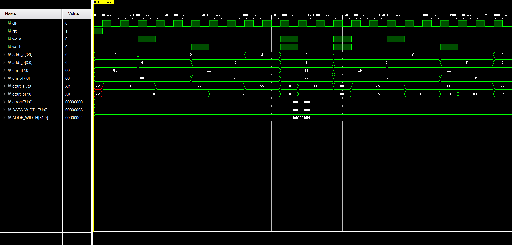
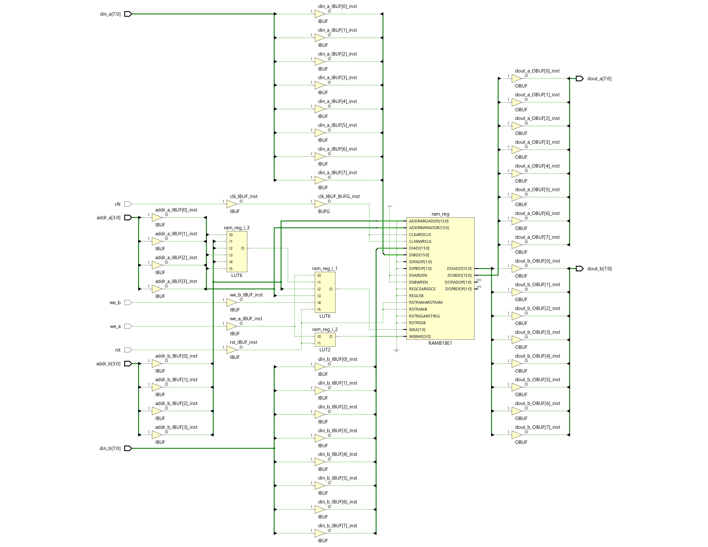
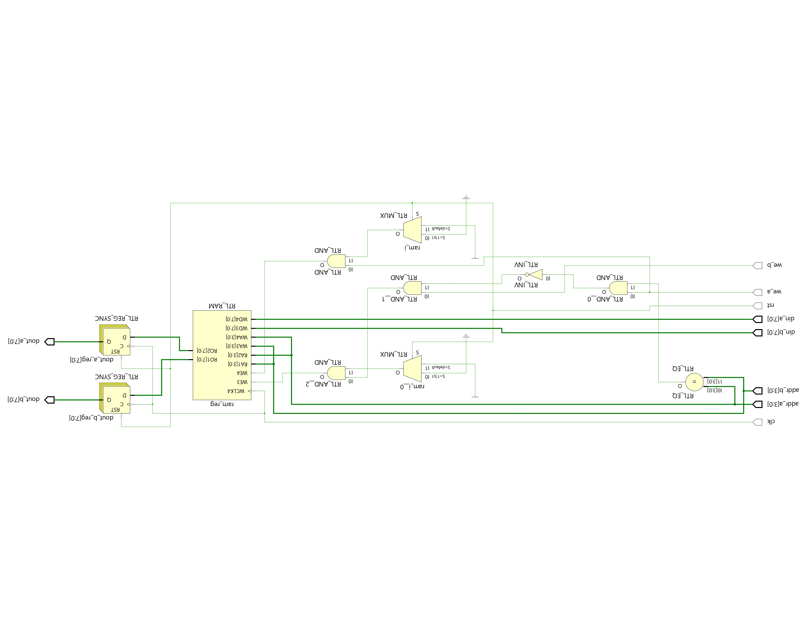

# Synchronous Dual-Port RAM

A parameterized dual-port synchronous RAM with independent read/write on both ports and collision arbitration.

## Design

The RAM is fully synchronous (writes and reads latch on the rising clock edge). Both ports share the same memory array, so data written by one port is immediately visible to the other on the next clock cycle.

| Parameter | Default | Description |
|-----------|---------|-------------|
| `DATA_WIDTH` | 8 | Data bus width per port |
| `ADDR_WIDTH` | 4 | Address width (RAM depth = 2^ADDR_WIDTH) |

**Collision handling:** When both ports try to write to the same address on the same clock cycle, Port A's write takes priority and Port B's write is silently dropped. A real-world design would flag this as an error; this implementation uses the simple "Port A wins" policy.

## Testbench

The self-checking SystemVerilog testbench (`tb/tb_dual_port_ram.sv`) covers these scenarios:

| Test | Description |
|------|-------------|
| 1 | Port A basic write/read |
| 2 | Port B basic write/read |
| 3 | Shared memory — Port A reads what Port B wrote |
| 4 | Both ports write to different addresses simultaneously |
| 5 | Collision — both ports write to the same address (Port A wins) |
| 6 | Boundary addresses (0 and max) |
| 7 | Data retention across operations |

Each test prints `[PASS]` or `[FAIL]`, and the final summary reports the total error count.

## Simulation Results

### Simulation Waveform



### Synthesized Schematic



### Post-Synthesis Simulation



## How to Simulate

1. Open Vivado and create a new project
2. Add `src/dual_port_ram.v` and `tb/tb_dual_port_ram.sv` as sources
3. Set `tb_dual_port_ram` as the top simulation module
4. Run behavioral simulation

Console output should end with:
```
  ALL TESTS PASSED (0 errors)
```
